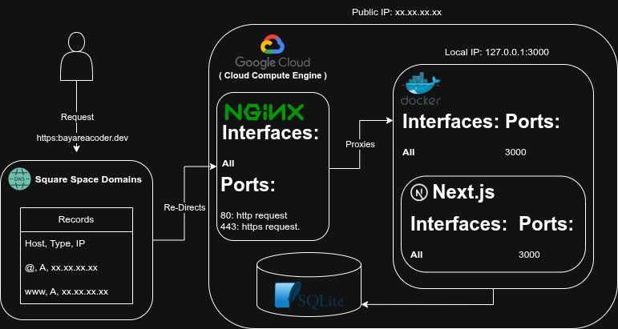

# Personal Website — Portfolio.v3

**Live Site:** [https://bayareacoder.dev](https://bayareacoder.dev)

## Overview

This is the third major iteration of my personal website, designed to mature the structure, improve maintainability, and intentionally **over-engineer the backend** to maximize customization and real-world infrastructure practice.

The project serves both as a personal showcase and a technical exercise, incorporating a production-style deployment pipeline, server infrastructure, and modular backend components.

---

## Objectives

✅ Modernize and professionalize the presentation of my online portfolio  
✅ Build a fully customized, self-hosted backend architecture  
✅ Gain hands-on experience with Nginx reverse proxying, Dockerized services, and cloud deployment  
✅ Design the system for future scalability and flexibility  

---

## Tech Stack

| Layer          | Tech                          | Notes                                               |
|----------------|------------------------------|-----------------------------------------------------|
| **Frontend**   | Next.js (Production Build)   | Responsive, server-rendered React framework         |
| **Backend**    | Node.js (via Next.js)        | Handles API routes and server-side logic            |
| **Web Server** | Nginx                        | Acts as reverse proxy, handles HTTPS termination    |
| **Containerization** | Docker                  | Isolates the app, simplifies deployment             |
| **Database**   | SQLite                       | Lightweight, local database for dynamic features    |
| **Infrastructure** | Google Cloud Compute      | Self-hosted on a public VM with hardened setup      |
| **DNS**        | Squarespace Domains (A Records) | Domain routing to the cloud server                  |

---

## Deployment Flow

1. User requests `https://bayareacoder.dev`
2. DNS (managed through Squarespace) resolves domain to public IP of Google Cloud VM
3. Nginx receives traffic on ports 80/443, terminates SSL, proxies requests to the app
4. Docker container runs Next.js app, listening on port 3000
5. Backend handles dynamic routes, API logic, and SQLite interactions
6. Static assets and frontend pages served to the user

---

## Development Notes

- This project intentionally mimics production-style infrastructure to improve operational familiarity  
- Nginx is configured to only expose necessary ports; app runs isolated inside Docker  
- SQLite provides lightweight persistence without introducing external database complexity  
- Future enhancements may include CI/CD automation or transitioning to managed databases for scaling  

---

## Screenshots & Architecture

---

## License

This project is for personal use and demonstration purposes.

